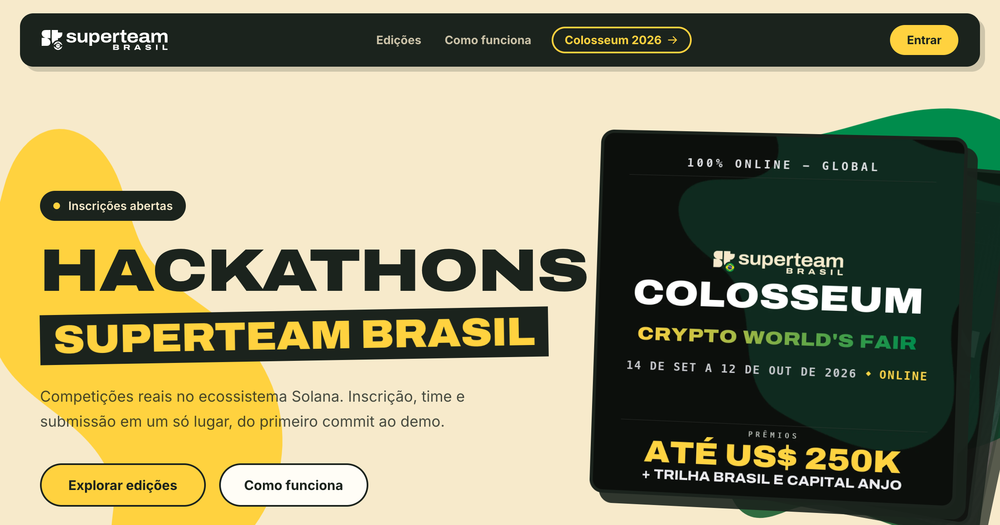

# Hackathon Platform



The platform that runs [Superteam Brasil](https://br.superteam.fun)'s hackathons, live at [hackathon.superteam.com.br](https://hackathon.superteam.com.br). One deploy, every edition — currently powering **Hackathon Solana & Cursor** (Passo Fundo/RS, Sep 2026).

## What it does

- **Edition pages written in markdown.** Organizers edit one document; the renderer reads each table's *shape* and draws it as a timeline, agenda, schedule or prize podium. New edition, zero code.
- **Teams without friction.** Leader creates the team and invites by email — existing accounts get an in-app invite, unknown emails become ghost members that link themselves at signup.
- **Deadlines that actually close.** `submit_team` validates and locks in Postgres; a `pg_cron` job sweeps overdue teams every minute. No trust in client clocks.
- **Two-round judging.** Per-judge assignments, 0–10 grades, averages feed a finalist picker; the public reveal is date-gated.
- **Scoped admins.** A role row makes someone a global admin or the organizer of exactly one edition — enforced in every write, not just the UI.
- **External editions.** An edition can live on another site; the hub cards send people there and deep links redirect.
- pt-BR interface, sticker-style design system, Sentry + PostHog wired in.

## Run it

```bash
npm install
cp .env.example .env.local   # fill in Supabase keys
npm run dev                  # http://localhost:3000
```

Apply `supabase/migrations/` in order to a Supabase project (CLI or SQL editor), and you have the whole thing locally. `npm test` runs the unit suite, `npm run build` catches type errors.

| Var | Purpose |
|---|---|
| `NEXT_PUBLIC_SUPABASE_URL` / `NEXT_PUBLIC_SUPABASE_ANON_KEY` | Supabase project + user-scoped key |
| `SUPABASE_SERVICE_ROLE_KEY` | Server-only key for admin actions |
| `RESEND_API_KEY` / `RESEND_FROM` | Optional — without them emails log to the console |
| `NEXT_PUBLIC_SITE_URL` | Optional canonical URL for links in emails |
| `NEXT_PUBLIC_SENTRY_DSN` (+ `SENTRY_ORG`/`SENTRY_PROJECT`/`SENTRY_AUTH_TOKEN`) | Optional — error monitoring |
| `NEXT_PUBLIC_POSTHOG_KEY` | Optional — product analytics |

Admin and judge are rows in `platform_roles`, granted in-app at `/admin/people` — no env allowlists.

## Stack

Next.js 16 App Router · React 19 · TypeScript · Supabase (Postgres, Auth, RLS, Storage, pg_cron) · Tailwind v4 · Resend · Vitest · Vercel.

## How it's built

Two route groups: `(public)/` for the hub, edition pages and the projects gallery; `(app)/` behind auth middleware for the participant painel, `/judge` and `/admin`. Member-facing writes go through `SECURITY DEFINER` RPCs with explicit `auth.uid()` checks; admin writes go through server actions that gate on the caller's role and scope every mutation to the gated edition. Single-table access is plain RLS.

The deeper operational notes — migration gotchas, the edition date model, per-flow details — live in [CLAUDE.md](CLAUDE.md) and [`docs/`](docs/).

## Conventions for contributors

- UI copy in **pt-BR**; code, routes and everything in git in **English**.
- Query errors are never swallowed — route them through `unwrap()`/`logQueryError()`.
- `.maybeSingle()` over `.single()`; every `(app)/` page exports `dynamic = "force-dynamic"`.
- No code comments by default; when one earns its place, it explains *why*.
- Design tokens live in `globals.css` — cream ground, ink, emerald, Superteam yellow, sticker cards.
