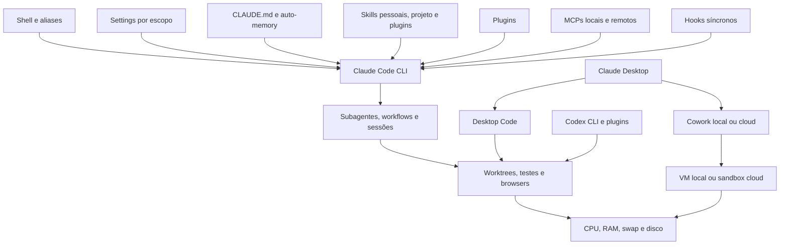

# Baseline técnico do ambiente de IA do Felix

> **SNAPSHOT HISTÓRICO PRÉ-REMEDIAÇÃO — 2026-09-10T07:00Z.** Este documento preserva a evidência anterior e não descreve a configuração atual.

**Data da coleta:** 2026-09-10
**Estado:** baseline forense e hipótese de desempenho; não é certificação
**Objetivo:** investigar por que tarefas no Claude podem durar 20–40 minutos e fornecer uma referência segura para comparar o ambiente da Laura
**Escopo:** Claude Code CLI, Claude Desktop/Cowork, Codex, configuração, instruções, memória, skills, plugins, MCPs, hooks, sessões, agentes, processos, worktrees e pressão do host

## 1. Como ler este documento

Cada afirmação relevante recebe uma destas marcas:

- **[MEDIDO]**: veio de arquivo estrutural, metadado, benchmark, telemetria ou snapshot local. Uma medida de snapshot descreve aquele instante; não prova comportamento contínuo.
- **[INFERÊNCIA]**: interpretação compatível com as medidas. “Confiança alta” indica uma hipótese bem sustentada, não causalidade já demonstrada.
- **[MEDIR NA LAURA]**: dado equivalente que precisa ser coletado no computador ou na conta da Laura.
- **[REMEDIAÇÃO]** e **[AÇÃO]**: recomendação prescritiva. Essas marcas não são classe de evidência; sua eficácia precisa ser medida depois da mudança.

O inventário foi feito sem abrir conteúdo de conversas, prompts, histórico de shell, valores sensíveis de variáveis de ambiente, credenciais, Keychain, argumentos sensíveis de MCP, código dos repositórios ou texto produzido pelo modelo. Seletores operacionais não sensíveis, como família de modelo e nível de effort, foram resumidos porque são necessários para comparar desempenho. Os paths abaixo usam `$HOME`. Nomes de sessões, branches privadas e identificadores de processos foram omitidos.

O relatório redigido que sustenta a parte estrutural está em `evidence/felix-ai-environment.redacted.json`. Ele usa referências HMAC para paths e componentes. Algumas medições mais profundas foram feitas separadamente porque o coletor, por desenho, não lê conteúdo de sessão nem linhas de comando completas.

## 2. Diagnóstico executivo

**[MEDIDO]** As sondas locais de shell, binário do Claude e conexão TLS produziram:

| Sonda | Resultado |
|---|---:|
| zsh interativo, mediana | 204 ms |
| zsh interativo, primeira amostra fria | 630 ms |
| `claude --help`, mediana | 102 ms |
| Anthropic sem autenticação, DNS + TLS + TTFB/total, mediana | 77 ms |

**[INFERÊNCIA, confiança alta]** Esses tempos tornam shell, lançamento do binário e rede básica causas principais pouco prováveis para atrasos de 20–40 minutos. Eles não medem fila do serviço, inferência do modelo nem execução de um workflow.

**[MEDIDO]** A telemetria de 14 dias reproduz o sintoma e aponta para expansão do trabalho:

| Indicador | Resultado |
|---|---:|
| Workflows únicos observados | 202 |
| Duração mediana | 3,76 min |
| p95 de duração | 19,34 min |
| Workflows acima de 20 min | 10 |
| Workflows acima de 40 min | 8 |
| Cache lido por iteração, mediana | 371 mil tokens |
| Cache lido por iteração, p95 | 916 mil tokens |
| Compactações perto de 1 milhão de tokens | 94–182 s |
| Skills registradas em runtime, mediana / máximo | 318 / 392 |
| Ferramentas diferidas, mediana | 257 |
| Fan-out de agentes, mediana / máximo | 11,5 / 59 |
| Correlação duração × tokens | `r = 0,76` |
| Correlação duração × tool calls | `r = 0,57` |

A duração usa **202 workflows únicos** como denominador. O resumo disponível não preservou o número de iterações de token, o número de compactações, o estimador exato do p95, a escolha Pearson/Spearman, outliers nem timeouts por métrica. Esses campos precisam entrar na próxima exportação; até lá, p95 e `r` servem para priorizar hipóteses, não para estimar SLA ou efeito causal.

**[INFERÊNCIA, confiança alta como prioridade de investigação]** A hipótese principal no baseline Felix é a combinação de contexto muito grande, modelo Opus, esforço alto ou xhigh e workflows que delegam e verificam bastante. A correlação de 0,76 não prova causalidade nem que tokens sejam a única causa; mostra que expansão de contexto acompanha duração nessa amostra.

**[INFERÊNCIA, confiança média]** Disco quase cheio, swap historicamente elevado, browsers/WebViews e VS Code aumentam variância e cauda de latência. O snapshot não mostrou CPU, I/O nem pageout ativos suficientes para explicar sozinho uma espera universal de 20–40 minutos.

**Conclusão operacional:** este ambiente é um perfil de profundidade e cobertura, com custo alto por tarefa. Ele é útil como referência de mecanismos, mas não deve ser copiado literalmente para a Laura.

## 3. Mapa das superfícies

O diagrama mostra superfícies, não uma afirmação de que todas estavam ativas ao mesmo tempo.

## 4. Produtos e runtimes: CLI, Desktop, Cowork e Codex não são o mesmo ambiente

### 4.1 Claude Code CLI

**[MEDIDO]** A versão instalada é Claude Code `2.1.263`, binário nativo `arm64` sob `$HOME/.npm-global`. O mesmo diretório aparece duas vezes no `PATH`, e as duas entradas resolvem para o mesmo executável.

**[INFERÊNCIA, confiança alta]** A duplicação do mesmo path é redundante, mas não oferece mecanismo plausível para atrasar cada turno em dezenas de minutos.

**[MEDIDO]** A atualização automática está desativada. `claude doctor` conseguiu analisar a configuração local. A checagem de política remota não pôde ser concluída no sandbox de coleta sem autenticação, e qualquer aviso de Keychain nesse contexto é inconclusivo.

**[MEDIDO]** O `--help` da versão 2.1.263 oferece controles importantes para diagnóstico: modelo, effort, safe mode, desativação de skills/commands, seleção de fontes de settings, configuração MCP estrita e sessão sem persistência. O safe mode mantém autenticação, modelo, ferramentas nativas, permissões e política managed, enquanto desliga customizações não gerenciadas. Sessão sem persistência só se aplica ao modo `--print`.

**[INFERÊNCIA, confiança alta]** Como preserva o caminho normal de autenticação, safe mode é o melhor primeiro isolamento das customizações. Ele ainda não isola política managed, modelo, conta ou serviço remoto.

**[INFERÊNCIA]** O startup do executável é saudável. O custo aparece depois que o runtime resolve contexto, customizações e o plano de trabalho.

### 4.2 Claude Desktop e Desktop Code

**[MEDIDO]** O Claude Desktop instalado reportou versão `1.49585.0`. O diretório de Application Support ocupa 11,2 GiB; 9,28 GiB correspondem a bundles de VM. Tamanho em disco não demonstra que uma VM estava ativa nem que ela causou uma tarefa lenta.

**[MEDIDO — documentação oficial]** Claude Code no terminal, IDE e Desktop local lê os mesmos settings locais, respeitando os escopos aplicáveis. Desktop Code também pode isolar sessões em worktrees. Cada worktree recebe um checkout fresco e exige inicialização do ambiente; depois disso, pode manter dependências e caches próprios. Plugins de escopo de projeto e aprovações locais do repositório podem ser compartilhados com o checkout principal.

**[MEDIR NA LAURA]** Registrar separadamente:

1. versão do Claude Desktop;
2. se a tarefa foi aberta em Desktop Code, terminal, extensão de IDE ou Cowork;
3. pasta conectada e commit lógico, em referência redigida;
4. se o Desktop criou worktree;
5. contagem de tarefas/abas/sessões simultâneas;
6. tamanho dos bundles e, principalmente, presença de VM/processos ativos durante a lentidão.

### 4.3 Cowork local e Cowork cloud

**[MEDIDO — documentação oficial]** Cowork cloud é o padrão atual: loop do agente e execução de código rodam em sandbox temporário nos servidores da Anthropic. Acesso a arquivo local ou browser passa pelo Desktop como broker. MCP local não roda dentro da sessão cloud.

**[MEDIDO — documentação oficial]** Em instalações que ainda usam Cowork local, o loop do agente, leitura/escrita de arquivos, web e MCPs locais rodam no dispositivo; comandos e código rodam em VM Linux isolada.

**[MEDIDO — documentação oficial]** Cowork e sessões cloud não carregam automaticamente `$HOME/.claude/skills/`. Elas usam skills habilitadas na conta claude.ai; sessões cloud também podem carregar skills de projeto versionadas. Uma rotina local agendada pelo Desktop tem comportamento diferente e pode carregar skills pessoais da máquina.

**[INFERÊNCIA, confiança alta]** Pressão do host tem mecanismo direto sobre Cowork local; no cloud, seu efeito principal fica no Desktop broker, arquivos/browser locais e concorrência da interface. Dizer apenas “Claude/Cowork está lento” mistura pelo menos três pipelines. Um teste que compara CLI local com Cowork cloud sem registrar o modo não permite atribuir o problema à máquina, às skills locais ou à conta.

**[MEDIR NA LAURA]** Em cada amostra, registrar `produto = CLI | Desktop Code | Cowork`, `execução = local | cloud`, modelo, effort, sessão nova ou retomada e fontes de customização visíveis. Não misturar essas amostras na mesma mediana.

### 4.4 Codex e catálogo compartilhado

**[MEDIDO]** O ambiente Codex do Felix usa a família `gpt-6-astra` com effort `xhigh`. O arquivo estrutural contém três MCPs e nenhum profile. O relatório não exporta seus argumentos, endpoints ou valores.

**[MEDIDO]** Existem 17 manifests `SKILL.md` sob `$HOME/.codex/skills` e 34 sob o cache de plugins do Codex. Os diretórios ocupam aproximadamente 2,8 MB e 47 MB, respectivamente. O catálogo compartilhado `$HOME/.agents/skills` contém 230 manifests e também alimenta referências por symlink em outros runtimes. `$HOME/.codex/AGENTS.md` contém 24 linhas/1.064 B.

**[MEDIDO]** O snapshot encontrou três processos Codex, cerca de 391 MiB de RSS agregado. `$HOME/.codex` ocupa aproximadamente 5,03 GiB, além de 1,59 GiB de runtimes Codex dentro de `$HOME/.cache`.

**[MEDIDO]** No snapshot, Codex aparece como processo e configuração separados do Claude; não foi observado como filho interno de uma chamada Claude.

**[INFERÊNCIA, confiança média]** Quando fica aberto, Codex compete pelo mesmo host. O catálogo compartilhado também mostra por que contar somente `$HOME/.claude/skills` não descreve todo o trabalho com IA do Felix. Na Laura, outros copilotos/agentes devem ser registrados como classe separada; um atraso Claude só pode ser atribuído a essa concorrência quando houver sobreposição temporal medida.

## 5. Precedência e escopos de configuração

Segundo a [documentação oficial de settings](https://code.claude.com/docs/en/settings), a precedência geral, da mais forte para a mais fraca, é:

1. managed/organizacional;
2. argumentos de linha de comando da sessão;
3. `.claude/settings.local.json` do projeto;
4. `.claude/settings.json` compartilhado;
5. `$HOME/.claude/settings.json` do usuário.

Variáveis de ambiente são resolvidas de acordo com a chave, e listas como permissões podem ser combinadas entre escopos em vez de simplesmente substituídas. Por isso o tamanho de um único JSON não representa toda a configuração efetiva. `/status` é a prova de quais fontes foram carregadas na sessão; ele não atribui cada chave à sua fonte.

### 5.1 Arquivos observados

| Escopo | Path normalizado | Medida | Alcance observado |
|---|---|---:|---|
| Usuário | `$HOME/.claude/settings.json` | 2.601 B | Todos os projetos locais dessa conta |
| Local do projeto `$HOME` | `$HOME/.claude/settings.local.json` | 16.298 B | Sessões iniciadas no projeto cuja raiz é `$HOME`; não é um segundo settings global |
| Local LiqPay | `<LIQPAY>/.claude/settings.local.json` | 1.525 B | LiqPay e worktrees conforme regras da versão atual |
| Compartilhado UX | `<UX>/.claude/settings.json` | 606 B | Checkout/repositório visual |
| Local UX | `<UX>/.claude/settings.local.json` | 2.571 B | Operador naquele projeto |
| Managed local | paths macOS/Linux documentados | ausente | Nenhuma política local encontrada |

**[MEDIDO]** O settings de usuário contém `opus[1m]`, esforço `xhigh`, modelo conselheiro `fable` com esforço baixo, modo padrão de permissão, quatro plugins habilitados e sete registros de hook. As permissões declaradas no arquivo incluem 12 regras de allow. Valores sensíveis não foram coletados.

**[MEDIDO]** O arquivo local de `$HOME` contém 136 regras de allow, duas pastas adicionais e um plugin de setup. Ele só participa quando esse escopo de projeto se aplica.

**[INFERÊNCIA, confiança alta]** Tratá-lo como um segundo settings global superestimaria o ambiente efetivo fora do projeto `$HOME`.

**[MEDIDO]** O local LiqPay contém 16 regras de allow. O compartilhado UX contém 12 regras e uma pasta adicional; o local UX contém 46 regras. Três checkouts relacionados ao UX apresentaram hashes idênticos desses settings.

**[INFERÊNCIA, confiança alta]** Os hashes mostram conteúdo igual em três checkouts; não demonstram três cargas simultâneas na mesma sessão.

**[MEDIDO]** Não foi encontrado arquivo managed local. Isso não exclui política server-managed; a coleta não autenticada não conseguiu confirmá-la.

**[MEDIR NA LAURA]** Capturar de uma sessão afetada:

- a lista “Setting sources” de `/status`, sem valores;
- contagens de allow/ask/deny por fonte;
- modelo e effort efetivamente mostrados no cabeçalho;
- plugins habilitados por fonte;
- quantidade e tipo de hooks;
- existência de managed/server-managed settings;
- se o CWD é a raiz do repositório, uma subpasta ou uma worktree.

## 6. Modelo, effort, ambiente e aliases

### 6.1 Estado Felix

**[MEDIDO]** Há mais de uma autoridade tentando escolher modelo e effort:

- settings de usuário: `opus[1m]` e `xhigh`;
- shell: `ANTHROPIC_MODEL` resolve para a família Opus e `CLAUDE_CODE_EFFORT_LEVEL` para `high` no ambiente coletado;
- ambiente da coleta: três variáveis na categoria Anthropic/Claude; nomes e valores foram deliberadamente omitidos;
- aliases: duas definições com o mesmo nome; a última vence no zsh e altera modelo, effort e modo de permissão;
- um alias de provedor alternativo contém endpoint e credencial em linha. O valor não foi lido nem incluído aqui.

**[INFERÊNCIA, confiança alta]** A divergência entre settings, ambiente e alias torna duas execuções visualmente semelhantes difíceis de comparar. A documentação dá precedência a `ANTHROPIC_MODEL` sobre o `model` de arquivo e coloca `CLAUDE_CODE_EFFORT_LEVEL` entre as escolhas explícitas de effort. Assim, o arquivo solicita `xhigh`, enquanto o shell coletado solicita `high`; uma flag ou escolha persistida ainda pode alterar a sessão. O cabeçalho e `/status` são a evidência correta do resultado efetivo.

**[MEDIDO — documentação oficial]** Esforço maior permite raciocínio mais profundo e consome mais tokens; `max` é explicitamente sujeito a retornos decrescentes e overthinking. Modelo e effort podem ser escolhidos por sessão sem editar o baseline.

**[REMEDIAÇÃO]** Definir perfis de tarefa, sem copiar aliases:

| Perfil | Uso | Modelo/effort de partida | Escalonamento |
|---|---|---|---|
| Interativo visual | CSS, copy, ajuste de componente, diagnóstico curto | modelo rápido, `medium` | subir apenas se houver ambiguidade real |
| Implementação comum | mudança focalizada com testes relevantes | Sonnet ou equivalente, `high` | Opus para decisão arquitetural ou falha repetida |
| Auditoria profunda | ameaça, dinheiro, concorrência, migração ampla | Opus, `high` ou `xhigh` | limitar fan-out e custo antes de ampliar contexto |

O modelo exato disponível depende da conta e política da organização. O A/B deve fixar explicitamente o mesmo modelo e effort em todas as variantes.

**[MEDIR NA LAURA]** Inventariar arquivos e shell por estrutura, sem compartilhar valores. Procurar duplicidade de aliases e registrar qual definição vence. Se houver credencial embutida em alias, removê-la do shell e rotacioná-la por processo seguro; ela não deve ser copiada para o relatório.

## 7. Instruções e memória

### 7.1 Instruções permanentes

**[MEDIDO]** O baseline pessoal tem:

| Fonte | Tamanho | Linhas | Comportamento |
|---|---:|---:|---|
| `$HOME/.claude/CLAUDE.md` | 3.811 B | 92 | Carregado globalmente; faz um import |
| arquivo “Brain” importado | 8.338 B | 197 | Entra pelo import global |
| Total pessoal candidato | 12.149 B | 289 | Antes das instruções do projeto |

**[MEDIDO]** No projeto LiqPay, o índice `MEMORY.md` tem 24.812 B e 176 linhas. O candidato pessoal + índice é 36.961 B antes de considerar system prompt, catálogo de tools/skills, conversa, arquivos lidos e resultados de ferramentas.

**[MEDIDO]** No projeto UX, dois arquivos de instrução somam 8.787 B. Com o baseline pessoal, o candidato fica em 20.936 B.

**[MEDIDO — documentação oficial]** Cada `CLAUDE.md` aplicável entra no contexto. Imports ajudam organização, mas não reduzem tokens. A recomendação oficial é manter cada arquivo abaixo de aproximadamente 200 linhas. O arquivo global importado está muito perto dessa marca.

### 7.2 Auto-memory

**[MEDIDO — documentação oficial]** No startup, auto-memory carrega as primeiras 200 linhas ou 25 KiB de `MEMORY.md`, o que ocorrer primeiro. O índice LiqPay, com 24.812 B, está perto do teto de bytes e cabe inteiro pelo limite de linhas.

**[MEDIDO]** Foram observados 183 arquivos de memória LiqPay, totalizando 676.709 B. No conjunto de 13 estados de memória, existem 353 arquivos e 1,10 MB. Isso não significa que 1,10 MB entre automaticamente em cada prompt: o índice entra no startup, e tópicos adicionais são lidos sob demanda.

**[INFERÊNCIA, confiança média-alta]** Um índice quase no teto aumenta o custo base e facilita que a sessão comece com decisões históricas demais. Quando a tarefa também chama skills, ferramentas e subagentes, esse custo inicial é multiplicado ou resumido em delegações.

**[REMEDIAÇÃO]** O índice deve conter apenas convenções atuais, referências curtas e links para tópicos. Remover decisões obsoletas, resultados de tarefas concluídas, duplicação de `CLAUDE.md` e instruções que só se aplicam a um path. Revalidar comportamento depois de cada redução; uma memória menor que perde um controle necessário não é melhoria.

**[MEDIR NA LAURA]** Contar bytes/linhas de cada `CLAUDE.md`, imports, rules por path e `MEMORY.md`. Em uma sessão afetada, usar a visão de contexto para confirmar o que realmente entrou. Não compartilhar o texto desses arquivos; compartilhar apenas contagens, hashes e fontes.

## 8. Skills: o maior catálogo não é necessariamente o conjunto efetivo

### 8.1 Inventário físico e lógico

**[MEDIDO]** `$HOME/.claude/skills` contém 272 diretórios lógicos: 43 físicos e 229 links para `$HOME/.agents/skills`. Desses, 271 têm `SKILL.md` válido. `$HOME/.agents/skills` contém 231 diretórios e 9,5 MB; a fachada em `$HOME/.claude/skills` ocupa cerca de 17 MB quando links são seguidos.

**[MEDIDO]** Todos os 271 `SKILL.md` válidos têm `name` e `description`. O catálogo de descrições soma 76.320 caracteres e o frontmatter completo soma 99.317 B.

**[MEDIDO]** A classificação estática encontrou:

| Propriedade | Quantidade |
|---|---:|
| Skills pessoais válidas em `$HOME/.claude/skills` | 271 |
| `user-invocable` explícito | 21 |
| `user-invocable: true` | 20 |
| `user-invocable: false` | 1 |
| `disable-model-invocation: true` | 0 |
| `context` explícito | 0 |
| `agent` explícito | 0 |
| `model` explícito | 0 |
| Descrições com expressão equivalente a “use quando” | 217 |
| Descrições com obrigação forte (“must”) | 2 |
| Skills lexicalmente ligadas a design/UI/qualidade | 35 |

**[MEDIDO — documentação oficial]** Por padrão, a descrição de uma skill é candidata à listagem que ajuda o modelo a decidir se deve invocá-la; o corpo completo entra quando a skill é chamada e permanece na conversa. `disable-model-invocation: true` retira a descrição e reserva a invocação ao usuário. Quando há muitas skills, Claude Code preserva todos os nomes, mas encurta ou retira descrições para caber num orçamento de 1% da janela de contexto.

**[INFERÊNCIA, confiança alta]** Como nenhuma das 271 usa `disable-model-invocation`, todas são elegíveis à seleção automática no CLI local. Isso não significa que os 76.320 caracteres completos foram injetados: a linha Skills de `/context` é a medida pós-orçamento que o modelo recebeu.

### 8.2 A correção de contagem

O inventário forense local, feito sobre caminhos conhecidos e seguindo seus symlinks, encontrou 583 referências: 302 candidatas Claude, 230 manifests compartilhados, 17 manifests Codex e 34 manifests no cache de plugins Codex. Há 334 conteúdos únicos. As 302 candidatas Claude somam aproximadamente 23.198 tokens brutos de nome+descrição e incluem instalações de plugin de escopos diferentes; são um **limite superior estrutural**, não prova de resolução simultânea nem de contexto efetivamente injetado.

O coletor compartilhável é deliberadamente mais restritivo: ele não segue diretórios por symlink nem lê alvos fora das raízes permitidas. Por isso, o relatório redigido registra 355 referências diretamente inspecionáveis e 74 candidatas Claude diretamente inspecionáveis. Esses números são um **limite inferior seguro para troca entre máquinas**. A diferença para 583/302 é esperada e não deve ser interpretada como mudança do ambiente.

O diretório compartilhado tem 231 pastas, mas 230 manifests válidos; a diferença é uma entrada sem `SKILL.md`. Para o diagnóstico de desempenho, a contagem pessoal de 271 skills válidas e a telemetria de runtime continuam sendo as evidências mais úteis.

**[MEDIDO — documentação oficial]** `$HOME/.claude/skills` é uma fonte pessoal documentada. `$HOME/.agents/skills` não aparece como uma segunda fonte pessoal independente do Claude Code. Links simbólicos são suportados e o mesmo target é carregado uma vez quando várias localizações apontam para ele.

**[INFERÊNCIA, confiança alta para inventário; ainda não causal]** Para o CLI, a melhor contagem estática do conjunto pessoal é **271 skills válidas**, acrescida de skills de projeto, plugins, bundled e eventualmente sincronizadas. A telemetria em runtime, que observou mediana 318 e máximo 392, é evidência mais forte do catálogo resolvido por sessão do que o limite estrutural do coletor. Ainda faltam a linha Skills de `/context` e a lista de invocações para saber o custo realmente injetado.

### 8.3 Sobreposições e anomalias

**[MEDIDO]** Quatorze nomes de skills do plugin Superpowers também existem no conjunto pessoal. Na variante de plugin carregada em `$HOME`, dez são byte a byte idênticas e quatro divergem. Na variante carregada nos repositórios avaliados, as 14 divergem em conteúdo ou semântica. A documentação informa que skills pessoais e de plugin coexistem porque o plugin usa namespace próprio.

**[INFERÊNCIA, confiança média]** A coexistência aumenta o conjunto de escolhas e pode apresentar instruções divergentes. É preciso observar a invocação para ligar isso a uma tarefa.

**[MEDIDO]** Há uma sobreposição divergente com a skill de Postgres do plugin Supabase.

**[MEDIDO]** As maiores skills de workflow e qualidade ficam na ordem de 4–12 KB cada; entre elas estão planejamento criativo, desenvolvimento por subagentes, debugging, TDD, despacho paralelo e verificação. Quando invocadas, seus corpos somam contexto persistente.

**[MEDIDO]** Anomalias de instalação:

- um link de skill aponta para target sem `SKILL.md`;
- uma skill fonte existe em `$HOME/.agents/skills`, mas não está ligada à fachada Claude;
- um link de uma skill de produto aponta para path sem versão estável;
- existe divergência singular/plural entre nome de diretório e frontmatter de uma skill de boas práticas.

Esses problemas afetam previsibilidade e manutenção. Não há evidência de que isoladamente causem atrasos de dezenas de minutos.

### 8.4 Por que isso importa especialmente para design

**[INFERÊNCIA, confiança média]** A tarefa típica da Laura toca UI, layout, animação, responsividade, acessibilidade, testes visuais, performance e polimento. Pelo menos 35 descrições pessoais têm sobreposição lexical com esse domínio, além de skills generalistas de brainstorming, TDD, debugging e verificação. Isso cria várias candidatas plausíveis; atribuir expansão a elas exige observar `/context` e quais skills foram realmente invocadas.

**[REMEDIAÇÃO]** Manter um conjunto pessoal pequeno e estável; mover skills raras para uso manual com `disable-model-invocation`; eliminar cópias equivalentes; escolher uma única versão de Superpowers por contexto; limitar skills de design automáticas às que representam gates reais do time. O alvo inicial sugerido para um perfil interativo é 8–12 descrições automaticamente elegíveis, validado por A/B.

**[MEDIR NA LAURA]** Obter `/skills` e `/context` na sessão afetada. Registrar somente contagens por origem, a linha Skills pós-orçamento, nomes versus descrições preservadas, corpos invocados durante a tarefa e sobreposição de nomes. Cowork deve ser medido pela conta claude.ai; `$HOME/.claude/skills` sozinho não descreve Cowork.

## 9. Plugins e componentes carregados

**[MEDIDO]** O registro local contém instalações repetidas em escopos diferentes:

| Plugin | Escopos/versões observados | Componentes relevantes |
|---|---|---|
| Superpowers | project `5.0.7`; user `6.3.0` | v5: 14 skills, 1 agent, 3 commands, 1 hook; v6: 14 skills, 1 hook |
| Context7 | project e user | 1 manifesto MCP em cada instalação |
| Code review | project e user | 1 command em cada instalação |
| Setup local | duas entradas locais `1.0.0` | 1 skill por entrada |
| Supabase | user `0.1.15` | 2 skills e 3 manifestos MCP |

**[MEDIDO]** A resolução muda com o diretório de trabalho. Sessões iniciadas em `$HOME` resolvem a instalação Superpowers v5 ligada ao projeto; LiqPay e UX resolvem a v6 do usuário. A carga inicial estimada dos plugins fica perto de 1.505 tokens em `$HOME` e 1.018 tokens nos repositórios analisados, antes de invocar corpos de skills.

**[MEDIDO]** Estimativas dos corpos on-demand de skills Superpowers relevantes:

| Skill | Corpo aproximado quando invocado |
|---|---:|
| desenvolvimento por subagentes | 8,0 mil tokens |
| brainstorming | 3,8 mil tokens |
| systematic debugging | 2,3 mil tokens |
| TDD | 2,2 mil tokens |

Acionar essas quatro, mais a verificação final, na mesma tarefa pode adicionar dezenas de milhares de tokens e mais ferramentas. A estimativa mede texto disponível; não prova que todas foram invocadas no mesmo workflow.

**[INFERÊNCIA, confiança média-alta]** A duplicação por escopo não implica que duas cópias do mesmo MCP conectem ao mesmo tempo; a resolução escolhe por precedência. Ela ainda cria ambiguidade de versão, catálogos sobrepostos e diferenças entre projetos.

**[REMEDIAÇÃO]** Consolidar cada plugin no escopo que corresponde ao seu dono. Para Superpowers, escolher uma versão e remover a segunda autoridade após teste. Para Context7 e code review, preservar uma definição por nome. Revisar plugin de setup duplicado. Fazer uma alteração por vez e repetir o benchmark.

**[MEDIR NA LAURA]** Registrar plugin, versão, escopo e componentes; comparar `/plugins` em CLI, Desktop Code e Cowork separadamente. Confirmar se a conta claude.ai ativa plugins adicionais que não existem no disco.

## 10. MCPs

### 10.1 Inventário Felix

**[MEDIDO]** Os MCPs ativos observados no Claude CLI são:

| Nome funcional | Transporte | Fonte/observação |
|---|---|---|
| codebase-memory | `stdio` local | definido em dois lugares com o mesmo nome |
| Context7 | remoto HTTP no escopo vencedor; uma definição de projeto usa `npx` | duplicado entre project e user |
| Supabase | remoto | fornecido pelo plugin/registro de usuário |
| Resend | remoto | registro de usuário |

Argumentos, URLs de autenticação, headers e valores de ambiente não foram emitidos. O MCP local inventariado não tinha environment entries no arquivo redigido. Os remotos usam seus mecanismos de autenticação sem expor material neste relatório.

**[MEDIDO — documentação oficial]** Quando o mesmo nome existe em vários escopos, Claude Code conecta uma vez usando a definição de maior precedência e não mistura campos. A ordem documentada é local, project, user, plugin e connector.

**[MEDIDO]** Em LiqPay, `claude mcp list` terminou em 895 ms no sandbox: o MCP local conectou; três remotos falharam rapidamente por DNS bloqueado naquele ambiente. Em `$HOME`, a variante Context7 baseada em `npx` excedeu 15 segundos. Essa segunda medida mistura cold start de `npx`, resolução de pacote e restrição de rede; ela não prova o tempo normal da Laura.

**[INFERÊNCIA, confiança média]** MCP remoto lento, reconexão, OAuth ou cold start via `npx` pode alongar startup e tool discovery. Com 257 ferramentas diferidas medianas, o catálogo de ferramentas também participa do contexto de decisão. MCP não explica sozinho a correlação forte com tokens e fan-out.

**[REMEDIAÇÃO]** Manter um único registro por nome; preferir transporte persistente/documentado à execução `npx` no startup quando houver alternativa; desabilitar MCP não usado no perfil interativo; medir conexão individual com timeout. Nunca remover o MCP de segurança/knowledge graph sem saber qual gate depende dele.

**[MEDIR NA LAURA]** Registrar nomes, tipos, escopos, estado e duração de conexão, sem argumentos ou tokens. Repetir com configuração MCP estrita e vazia como variante controlada; se melhorar, reativar um servidor por vez.

## 11. Hooks

### 11.1 Configuração

**[MEDIDO]** O settings de usuário contém sete registros:

- três `PreToolUse`: scanner de segredos em Bash, scanner de segredos em Write e gate codebase-memory em Grep/Glob;
- quatro `SessionStart`: lembretes para startup, resume, clear e compact.

O plugin Superpowers adiciona um hook de `SessionStart` para startup, clear e compact. Existem 12 executáveis auxiliares no diretório de hooks, mas scripts numerados de 02 a 10 não são referenciados pelos settings observados e estão dormentes.

### 11.2 Benchmarks

**[MEDIDO]** O scanner de segredos é síncrono e não declara timeout próprio. Ele tem 155 linhas, monta 36 padrões e usa loops, subshells, `grep` e `jq` repetidamente.

| Entrada neutra | Tempo observado |
|---|---:|
| Bash / uma linha | ~165–180 ms |
| Write / 10 linhas | ~0,7 s |
| Write / 50 linhas | ~3,5 s |
| Write / 100 linhas, medição separada | ~6,37 s |
| Gate codebase-memory | ~19–20 ms |
| Lembrete codebase-memory | ~12 ms |

As amostras vieram de execuções locais controladas e entradas sem segredo. O scanner não foi desativado nem contornado.

**[INFERÊNCIA, confiança alta para custo por write; média para custo total]** O algoritmo do scanner cresce aproximadamente com linhas × padrões × subprocessos. Muitas edições ou arquivos grandes podem acumular dezenas de segundos ou minutos. Ele não explica sozinho os workflows de 40 minutos, mas é um multiplicador determinístico e fácil de corrigir.

**[REMEDIAÇÃO]** Reimplementar a mesma política em processo único, compilando os padrões uma vez e lendo o evento uma vez. Preservar comportamento fail-closed, redaction e testes de equivalência com fixtures seguras. Definir timeout explícito compatível com fail-closed e medir p50/p95 por tamanho. Não trocar segurança por velocidade.

**[MEDIR NA LAURA]** Contar hooks por evento/escopo, síncronos versus assíncronos, timeout e latência por classe de input. O teste safe mode desliga hooks junto com outras customizações; depois, usar variantes de fonte ou settings controlados para isolar hook de skill/plugin.

## 12. Commands, agentes customizados, teams e daemon

### 12.1 Commands

**[MEDIDO]** Há 12 command files pessoais, total de 24.942 B. Quatro têm frontmatter estruturado e oito usam o formato legado. Commands são acionados manualmente; a simples existência não prova execução automática. Para novos fluxos, a documentação atual prefere skills.

### 12.2 Agentes customizados

**[MEDIDO]** Não existem definições em `$HOME/.claude/agents` nem `.claude/agents` nos projetos examinados. Em sessões iniciadas em `$HOME`, Superpowers v5 fornece um agente de code review; nos repositórios que resolvem v6, esse agente não existe.

**[MEDIDO]** Foram identificados dez nomes de skills pessoais relacionados a agentes, teams, paralelo ou coordenação, além de skills Superpowers de delegação. Elas são elegíveis à invocação pelo modelo porque não bloqueiam model invocation.

**[MEDIDO]** Nenhum hook ou settings examinado contém regra incondicional para criar agentes no startup. Portanto, não há prova de auto-spawn puramente configuracional.

### 12.3 Delegação recursiva e fan-out

**[MEDIDO — documentação oficial atual]** Na versão atual, um subagente pode criar outros subagentes por padrão até três camadas abaixo da conversa principal. O limite concorrente padrão é 20 por sessão, mas não existe teto total de subagentes ao longo da sessão. Workflows e agent teams têm limites próprios.

**[INFERÊNCIA, confiança alta para capacidade]** Há capacidade técnica para fan-out recursivo mesmo sem arquivo de agente customizado. A presença da capacidade não prova que uma tarefa específica a usou.

**[MEDIDO]** A telemetria observou fan-out mediano de 11,5 agentes e máximo de 59 por workflow. Esses valores contam agentes associados ao workflow; não demonstram que 59 estavam simultaneamente ativos.

**[INFERÊNCIA, confiança alta]** A contagem é forte evidência de expansão total de delegação, mas precisa de timeline para medir concorrência.

**[MEDIDO]** O armazenamento de sessões contém 575 transcripts de subagente em 14 diretórios de projeto, total de 164 MB.

**[INFERÊNCIA, confiança alta]** O material prova uso histórico de delegação; não prova recursão em uma tarefa específica nem simultaneidade.

**[INFERÊNCIA, confiança média-alta]** Com skills de despacho e subagente automaticamente elegíveis, uma tarefa ampla pode acionar supervisor, implementadores, críticos e verificadores. Cada worker inicia contexto próprio; forks podem herdar contexto maior. O fan-out observado é compatível com espera por resultados, rate limit, compactação e testes repetidos, mas falta a linha do tempo por agente para atribuir duração.

### 12.4 Daemon, background e estado antigo

**[MEDIDO]** Quatro registros de job foram encontrados: três marcados como trabalhando e um bloqueado. O status do daemon mostrava zero workers e o CLI atual expunha apenas um job bloqueado. O metadado tinha cerca de 60 horas e apontava para supervisor já ausente.

**[INFERÊNCIA, confiança alta]** A divergência é compatível com estado obsoleto; não demonstra workers ativos ocultos.

**[MEDIDO]** Um processo Claude estava adotado pelo PID 1 havia cerca de dois dias, e um host em background estava adotado pelo PID 1 havia cerca de oito dias.

**[INFERÊNCIA, confiança baixa-média]** São candidatos a órfãos. Idade e PPID não provam que sejam inúteis; podem representar serviço deliberado.

**[REMEDIAÇÃO]** Aplicar a política `FANOUT-WORKTREE-POLICY.md`: teto de agentes por perfil, profundidade 1 como default interno, leases, dono por worker, um writer por worktree, fila de suíte pesada e quarentena de processos sem dono. Revisar manualmente jobs/processos antigos antes de parar qualquer um.

**[MEDIR NA LAURA]** Para cada tarefa lenta, registrar total criado, pico simultâneo, profundidade máxima, duração por agente, tipo de contexto (novo/fork), retries e quem iniciou a delegação. “59 agentes” sem linha do tempo é insuficiente; “pico 12 por 8 minutos” é causalmente útil.

## 13. Sessões, contexto, cache e compactação

### 13.1 Persistência local

**[MEDIDO]** `$HOME/.claude` ocupa aproximadamente 619 MB; `projects/` responde por 549 MB. Existem 608 arquivos JSONL somando 547 MB: 33 transcripts raiz somam 383 MB e 575 transcripts de subagente somam 164 MB. Quatorze arquivos passam de 10 MiB; o maior tem 57,35 MiB.

**[MEDIDO — arquitetura]** Uma sessão nova não carrega automaticamente todos esses arquivos de histórico.

**[INFERÊNCIA, confiança média-alta]** O custo do armazenamento histórico passa a ser relevante ao retomar uma sessão grande, continuar a mais recente, reconstruir cache após mudança de modelo ou compactar.

### 13.2 Runtime de 14 dias

**[MEDIDO]** Cache read por iteração tem mediana de 371 mil tokens e p95 de 916 mil. Compactações perto de 1 milhão levaram 94–182 s. O modelo foi configurado com contexto estendido de 1 milhão.

**[INFERÊNCIA, confiança alta como hipótese]** Esses tempos são compatíveis com pausas de minutos em sessões maduras. Uma nova leitura de cache, troca de modelo, compactação ou retomada pode ocorrer no meio do workflow; a atribuição exige o evento e timestamp da sessão afetada.

**[REMEDIAÇÃO]** Para tarefas focais, começar sessão nova; não usar resume/continue como padrão. Guardar estado durável em arquivos pequenos e versionados em vez de depender de conversa longa. Encerrar a sessão quando o objetivo muda. Fixar modelo durante a bateria, porque troca de modelo quebra o cache daquela conversa. Usar sessão sem persistência nos benchmarks sintéticos.

**[MEDIR NA LAURA]** Capturar cache creation/read, input/output tokens, número e duração de compactações, tamanho do transcript selecionado e se houve troca de modelo. Não compartilhar texto de transcript.

## 14. Worktrees e duplicação de ambientes

### 14.1 LiqPay

**[MEDIDO]** Existem 15 worktrees LiqPay, todos presentes, limpos em arquivos rastreados e não marcados como prunable. A atribuição lógica é 18,7 GiB, dos quais 15,46 GiB são `node_modules`.

**[MEDIDO]** Nenhum checkout secundário LiqPay era o CWD de um agente no snapshot. Dois worktrees temporários criados pelo Claude estavam inativos e não eram prunable; um deles ocupava aproximadamente 1,15 GiB.

**[INFERÊNCIA, confiança alta]** Eles são candidatos a revisão, não a remoção automática.

### 14.2 Outros checkouts e configuração

**[MEDIDO]** Checkouts UX e derivados apresentaram settings com hashes idênticos. Na versão atual, plugins de escopo de projeto e aprovações locais podem ser compartilhados entre worktrees do mesmo repositório; dependências, builds, watchers e servidores continuam específicos de cada checkout.

**[MEDIDO — arquitetura e snapshot]** Uma worktree é um checkout isolado, não uma cópia automática do contexto de uma sessão. O snapshot não encontrou execução secundária LiqPay suficiente para associar a espera atual a worktrees.

**[INFERÊNCIA, confiança alta]** Worktrees aumentam armazenamento e podem multiplicar processos quando cada checkout mantém `node_modules`, dev server, watcher, browser ou teste. O efeito sobre latência depende de esses processos existirem ao mesmo tempo.

**[REMEDIAÇÃO]** Manter no máximo quatro worktrees ativos por repositório como default operacional, cada um com dono e lease. Centralizar a suíte completa. Revisar worktrees sem dono e remover apenas depois de confirmar ausência de alterações, commits, locks e processos. APFS/clones podem fazer o espaço recuperável diferir do tamanho lógico.

**[MEDIR NA LAURA]** Inventariar worktrees apenas dos repositórios declarados; associar cada processo ao CWD; contar `node_modules`, caches, watchers e browsers por worktree. Não concluir que “há cinco worktrees, então há cinco agentes”.

## 15. Forense do host Felix

### 15.1 Hardware e sistema

**[MEDIDO]** Mac M3 Pro, 12 CPUs lógicas, 36 GB RAM, macOS 26.6.2, Low Power Mode desligado.

**[INFERÊNCIA, confiança alta]** Somados ao baixo uso instantâneo de CPU e aos startups curtos, esses dados não sustentam CPU estruturalmente insuficiente como hipótese principal. Eles não excluem pressão episódica.

### 15.2 Disco, swap e caches

**[MEDIDO]** O volume Data estava em 97%, com cerca de 16 GiB livres. O swap mostrava 10,55 GiB usados de 12 GiB. Durante uma amostra curta de dois segundos não houve swap-out.

**[INFERÊNCIA, confiança alta]** O swap ocupado é compatível com pressão histórica ou páginas residentes; sem swap-out na amostra, ele não demonstra thrashing naquele instante.

| Área | Tamanho observado |
|---|---:|
| `$HOME/.cache` | 27,8 GiB |
| Hugging Face dentro de `.cache` | 15,9 GiB |
| uv dentro de `.cache` | 6,0 GiB |
| Whisper dentro de `.cache` | 2,1 GiB |
| runtimes Codex dentro de `.cache` | 1,59 GiB |
| `$HOME/.npm` | 17,1 GiB |
| Claude Application Support | 11,2 GiB |
| bundles de VM Claude | 9,28 GiB |
| `$HOME/.codex` | 5,03 GiB |

**[INFERÊNCIA, confiança média]** Pouco espaço livre reduz margem para swap, cache, instalação e builds; swap usado indica que o host passou por pressão de memória. Isso pode aumentar latência de cauda, mas a ausência de pageout e I/O alto no snapshot impede concluir que era a causa naquele momento.

### 15.3 Processos

**[MEDIDO]** O snapshot continha aproximadamente 748 processos:

| Classe | Quantidade | RSS/CPU aproximados |
|---|---:|---:|
| Claude CLI | 3 | 822 MiB |
| Codex | 3 | 391 MiB |
| codebase-memory | 14 | contagem, RSS agregado não atribuído aqui |
| Node | 11 | contagem |
| Context7 | 4 | contagem |
| Browsers/WebViews | vários auxiliares | 11,6 GiB e ~44% de um core |
| VS Code Helpers | vários | 1,2 GiB e ~35% de um core |

CPU agregada instantânea era equivalente a 1,92 dos 12 cores; I/O estava baixo; descritores de arquivo estavam longe do limite. Nenhum Playwright/Vitest/Jest/Cypress estava ativo. Dois dev servers em diretórios temporários escutavam há quatro e cinco dias.

**[INFERÊNCIA, confiança média]** Browser, IDE, processos de knowledge graph e serviços antigos são compatíveis com parte da pressão de memória e do swap. Como nenhum runner pesado estava ativo e a CPU estava folgada, eles são amplificadores plausíveis, não uma atribuição fechada do workflow.

**[REMEDIAÇÃO]** Recuperar margem de disco por revisão humana de caches e worktrees, fechar browsers/abas de teste que perderam dono, revisar servidores e processos adotados pelo PID 1. Medir antes/depois. Não apagar caches, branches ou worktrees em massa.

**[MEDIR NA LAURA]** Coletar três snapshots: idle, imediatamente antes da tarefa e durante a espera. Registrar memória pressure, swap-in/out, pageouts, CPU por classe, I/O, espaço livre e processos por CWD. “Uso de RAM baixo” no Activity Monitor não exclui espera remota, compactação ou fan-out.

## 16. Atribuição do caso `tsc + 195 testes + lint + Playwright`

O recorte observado mostrou o agente editando um componente visual, corrigindo reflow, executando TypeScript, 195 testes, lint, comparando warnings e iniciando uma verificação comportamental com Playwright. No momento capturado, a sessão marcava aproximadamente 9m22s e a sonda Playwright estava havia cerca de 14 segundos.

### 16.1 O que a evidência permite afirmar

**[MEDIDO]** O recorte registra edição, compilação, suíte de testes, lint e início de verificação no browser.

**[INFERÊNCIA, confiança alta]** A sequência mostra progresso observável e não traz evidência de deadlock naquele intervalo.

**[MEDIDO]** Os arquivos de instrução específicos do projeto UX não contêm gatilhos textuais para agentes, paralelismo, lint, Playwright ou verificação ampla. O settings local permite comandos dessas categorias.

**[INFERÊNCIA, confiança alta]** Uma regra de permissão autoriza o comando, mas não demonstra que ela ordenou sua execução.

**[MEDIDO]** O `CLAUDE.md` global contém quatro ocorrências ligadas a teste, cinco a verificação e duas a worktree. O Brain importado acrescenta duas de verificação e três de worktree. Nenhum dos dois contém gatilho textual para agent, subagent, spawn ou parallel. O conjunto pessoal/plugin contém TDD, systematic debugging, brainstorming e verification-before-completion, além de delegação.

**[MEDIDO]** Os dois arquivos `CLAUDE.md` do projeto UX não contêm ocorrências de test, verify, Playwright, lint, agent, subagent, spawn ou parallel.

**[INFERÊNCIA, confiança média para a disciplina global; baixa para uma skill específica]** A sequência é compatível com a instrução global de verificar antes de concluir. As skills Superpowers/pessoais de TDD e verificação são candidatas, mas não foram observadas como invocadas nesse recorte. Não há evidência para atribuí-la a uma regra do projeto UX.

**[INFERÊNCIA, confiança média]** Parte dos 9m22s é trabalho intencional: ler arquivos, editar, executar ferramentas e interpretar resultados. Cada Bash/Write também paga o hook de scanner. O recorte não mostra cache read, compactação, tempo do modelo, duração dos testes anteriores nem subagentes, então não permite decompor os nove minutos com precisão.

### 16.2 O que não deve ser concluído

- “Playwright ficou 9 minutos”: a captura mostra aproximadamente 14 segundos daquela sonda.
- “195 testes causaram tudo”: não há duração individual da suíte no recorte.
- “A máquina travou”: o agente produziu resultados e iniciou a próxima etapa.
- “As skills são a única causa”: a seleção/invocação efetiva não aparece na captura.
- “Mais RAM resolveria”: o gargalo pode estar em modelo, contexto, delegação, rede remota ou política de verificação.

### 16.3 Como atribuir corretamente na Laura

Medir duas sondas. A primeira é uma microsonda pública e determinística de startup/Read; ela localiza custo de bootstrap. A segunda é uma fixture end-to-end representativa com pequena edição de componente, Write, Bash, typecheck focalizado, testes, lint e uma asserção comportamental de browser; ela localiza o custo do fluxo visto no caso. Guardar apenas timestamps, contagens, tokens, exit codes e asserções de aceite. Comparar, em ambas:

1. perfil completo;
2. safe mode, mesmo modelo/effort e sessão nova;
3. skills e commands desativados;
4. MCP estrito e vazio;
5. fontes user, project e local isoladas;
6. perfil completo após cada correção.

Cada amostra end-to-end começa do mesmo estado limpo, com dependências e cache classificados como frios ou quentes. O resultado só é equivalente quando typecheck/test/lint/asserção de browser passam e a mudança fica dentro do escopo esperado. Se safe mode continuar lento nas duas sondas, a prioridade muda para conta/modelo, serviço remoto, fixture e host. Se safe mode ficar rápido, reativar uma camada por vez.

## 17. Matriz de hipóteses priorizadas

As forças abaixo são **anteriores à intervenção**. Elas ordenam investigação e não declaram causalidade no host Laura.

| Ordem | Hipótese | Evidência Felix | Força pré-A/B | Impacto provável | Remediação inicial | Prova de eficácia |
|---:|---|---|---|---|---|---|
| 1 | Contexto/cache/compactação excessivos | 371k tokens medianos; p95 916k; compactações 94–182s; `r=.76` | Alta | Muito alto | sessões focais novas; memória/instruções enxutas; evitar troca de modelo | queda de cache read, compactações e total com aceite equivalente |
| 2 | Expansão por skills e workflows | 318 skills medianas, 392 máx.; 257 tools diferidas; catálogos sobrepostos | Média até medir `/context` e invocações | Alto | allowlist pequena de skills automáticas; raras manuais; uma versão de plugin | linha Skills pós-budget, invocações e tempo caem no A/B |
| 3 | Modelo Opus + effort alto/xhigh | settings, shell e runtime apontam Opus/esforço elevado | Média-alta | Alto | perfil medium/high para design comum; escalar sob critério | mesmo model ID/tarefa, depois modelo alternativo com aceite equivalente |
| 4 | Fan-out e delegação recursiva | mediana 11,5; máx. 59; nesting padrão oficial até 3 níveis | Média-alta | Muito alto | quotas, profundidade 1 interna, dono/lease e critic apenas quando necessário | pico simultâneo, total de agentes e tokens caem sem perda de aceite |
| 5 | Scanner síncrono por linha/padrão | Bash de uma linha ~0,17s; Write ~3,5s/50 e 6,37s/100 linhas | Alta no custo do hook; média no total | Médio | processo único, mesmas regras, timeout e testes de equivalência | curva por tamanho cai e fixtures de segurança continuam passando |
| 6 | MCP duplicado/cold start remoto | Context7 project/user; `npx` >15s em sandbox; 257 tools diferidas | Média | Médio | uma definição por nome; desativar não usados; transporte estável | no-MCP melhora; reativação identifica servidor culpado |
| 7 | Retomada de sessão grande | 547MB JSONL; maior 57,35MB; cache próximo de 1M | Média-alta | Alto | sessão nova e persistência desligada no benchmark | nova sessão rápida, retomada lenta com mesma tarefa |
| 8 | Disco/swap/browser/IDE como amplificador | disco 97%; swap 10,55GiB; browsers 11,6GiB | Média | Médio/cauda | recuperar margem e reduzir processos com dono ausente | p95 e variância caem; pageout/swap estabilizam |
| 9 | Processos/daemon órfãos | dois servers antigos, dois candidatos PPID1, daemon stale | Baixa-média | Baixo/médio | revisar identidade e encerrar somente candidatos confirmados | RSS/processos caem e benchmark melhora repetidamente |
| 10 | Worktrees e caches duplicados | 15 LiqPay; 18,7GiB; 15,46GiB node_modules | Média para disco; baixa direta | Médio no host, baixo no turno isolado | lease/retention; remover só após revisão | espaço livre sobe; sem correlação direta se processos inativos |
| 11 | Shell, CPU básica ou rede bruta | shell 204ms; CLI 102ms; rede 77ms; CPU folgada | Baixa | Baixo | manter como sentinela, não priorizar tuning | regressão só se medidas mudarem na Laura |

## 18. Plano de remediação na ordem certa

### P0 — congelar a linha de base

**[AÇÃO]** Rodar o coletor redigido no computador da Laura, validar o JSON e registrar produto/modo, model ID resolvido, effort, conta e rede. Fazer um piloto de cinco amostras por modo e reportar mediana, MAD, máximo e timeouts. Não reportar p95 do piloto.

Para p95, coletar pelo menos 20 amostras por modo; 30 são preferíveis. Declarar o estimador, o denominador, timeouts e regra de outlier. Intercalar os modos em ordem aleatória balanceada e classificar execuções frias/quentes, evitando que um modo receba sempre o cache aquecido pelo anterior.

### P1 — microsonda de isolamento

**[AÇÃO]** Usar `--safe-mode` como primeira variante. Ele desliga CLAUDE.md, skills, plugins, hooks, MCPs, commands, agentes e outras customizações não gerenciadas, mantendo autenticação, ferramentas, modelo e política managed. O script `scripts/benchmark_claude_modes.py` implementa FULL e SAFE sem reter conteúdo do modelo, mas mede somente startup ou um Read. Ele diagnostica bootstrap; não reproduz o caso completo.

`--bare` não é a comparação primária: ele também muda o caminho de autenticação e pula Keychain/prefetch, então o resultado só é comparável quando essa diferença é controlada.

### P2 — fixture end-to-end representativa

**[AÇÃO]** Criar uma fixture descartável que faça uma edição pequena e conhecida, exerça Write/Bash, rode typecheck e testes focados, lint do escopo tocado e uma asserção DOM/visual no browser. Resetar o mesmo commit e estado de cache antes de cada amostra. O gate de resultado é: exit codes esperados, testes/assertions passando, nenhum arquivo extra e comportamento final equivalente. Duração sem esse gate não vale como melhoria.

### P3 — separar as camadas

**[AÇÃO]** Se SAFE for rápido, medir `NO_SKILLS_COMMANDS`, `NO_MCP` e fontes de settings isoladas. `--disable-slash-commands` desativa skills e commands. Modos USER/PROJECT/LOCAL não são isolamento puro: managed continua aplicável e instruções/memória precisam ser verificadas em `/status` e `/context`. Remover apenas uma variável por bateria. Se SAFE também for lento, investigar serviço/modelo/conta, Cowork cloud versus local e tarefa antes de editar a configuração.

### P4 — reduzir catálogo e ambiguidade

**[AÇÃO]** Tornar skills raras manuais, limitar skills de design automáticas, eliminar links quebrados e escolher uma versão de Superpowers. Consolidar Context7, code review e setup por escopo.

### P5 — controlar profundidade e concorrência

**[AÇÃO]** Aplicar `FANOUT-WORKTREE-POLICY.md`: dois agentes simultâneos para design interativo como default, profundidade 1, uma suíte completa por repositório, um writer por worktree, leases e registro de pico simultâneo.

### P6 — otimizar o hook sem perder o controle

**[AÇÃO]** Reescrever o scanner para processo único, medir curva por tamanho e manter fixtures negativas. O gate de segredo continua obrigatório.

### P7 — higiene de sessão e host

**[AÇÃO]** Sessões novas para objetivos novos; memória concisa; revisão de caches/worktrees/processos por dono; meta operacional de pelo menos 15% de disco livre; acompanhar pageout em vez de apenas “RAM usada”.

## 19. Checklist de comparação para a Laura

### Identidade da execução

- **[MEDIR NA LAURA]** Claude Code e Desktop: versão e arquitetura.
- **[MEDIR NA LAURA]** Produto: CLI, IDE, Desktop Code ou Cowork.
- **[MEDIR NA LAURA]** Execução Cowork: local ou cloud.
- **[MEDIR NA LAURA]** Conta/organização e presença de managed settings, sem identificador privado.
- **[MEDIR NA LAURA]** Model ID resolvido, alias pedido, effort e contexto efetivamente mostrados.

### Configuração e contexto

- **[MEDIR NA LAURA]** Fontes carregadas por `/status`.
- **[MEDIR NA LAURA]** Bytes/linhas de CLAUDE.md/imports/MEMORY.md.
- **[MEDIR NA LAURA]** Skills por origem, linha Skills pós-budget em `/context`, automáticas versus manuais e invocadas no caso.
- **[MEDIR NA LAURA]** Plugins por escopo/versão/componentes.
- **[MEDIR NA LAURA]** MCP por nome/tipo/escopo/tempo de conexão.
- **[MEDIR NA LAURA]** Hooks por evento, sync/async, timeout e p50/p95.

### Execução

- **[MEDIR NA LAURA]** Tempo até primeiro evento, primeiro texto, primeira tool call e total.
- **[MEDIR NA LAURA]** Tokens input/output/cache creation/cache read.
- **[MEDIR NA LAURA]** Compactações e duração.
- **[MEDIR NA LAURA]** Tool calls por classe e duração dos comandos.
- **[MEDIR NA LAURA]** Agentes totais, pico simultâneo e profundidade.
- **[MEDIR NA LAURA]** Sessão nova/retomada e troca de modelo.

### Host e workspace

- **[MEDIR NA LAURA]** CPU, memória pressure, swap-in/out, I/O e disco antes/durante.
- **[MEDIR NA LAURA]** Processos Claude/Desktop/browser/IDE/Node/MCP/teste por classe.
- **[MEDIR NA LAURA]** Worktrees, caches, watchers, dev servers e browsers por CWD.
- **[MEDIR NA LAURA]** Latência DNS/TLS para separar rede básica de espera do modelo.

### Bateria mínima

| Variante | Finalidade | Deve manter igual |
|---|---|---|
| FULL | baseline de cada sonda | commit, tarefa, model ID, effort, conta, rede |
| SAFE | efeito agregado das customizações não gerenciadas | tudo acima; managed continua aplicado |
| NO_SKILLS_COMMANDS | skills e commands; rótulo interno atual do script: `NO_SKILLS` | hooks/plugins/MCP restantes |
| NO_MCP | discovery/conexão MCP | skills/hooks/plugins restantes |
| USER_ONLY | fonte pessoal, sem alegar isolamento total | tarefa/model ID/effort; conferir `/status` e `/context` |
| PROJECT_ONLY | fonte compartilhada, sem alegar isolamento total | tarefa/model ID/effort; conferir `/status` e `/context` |
| LOCAL_ONLY | overrides locais, sem alegar isolamento total | tarefa/model ID/effort; conferir `/status` e `/context` |

Intercalar os modos; não executar todas as amostras de um modo em bloco. Separar cold e warm. Usar cinco amostras apenas como piloto de mediana/MAD/máximo; para p95, usar no mínimo 20 e preferir 30. Não retomar sessão nem iniciar outro agente/teste durante a bateria. Não usar debug bruto; ele pode registrar paths, prompts e inputs de ferramenta.

## 20. O que copiar e o que não copiar do Felix

### Pode ser reutilizado

- o coletor redigido e seu validador;
- o benchmark por camadas;
- a política de quotas, leases, writers e worktrees;
- o formato de evidência com hashes/contagens;
- o princípio de verificação proporcional ao risco;
- o scanner de segredos depois de otimizado e testado.

### Não deve ser copiado literalmente

- 271 skills pessoais elegíveis à seleção automática, sujeitas ao orçamento de listagem;
- duas versões de Superpowers em escopos diferentes;
- duplicatas de Context7/code review/setup;
- Opus com contexto de 1 milhão e xhigh como default universal;
- aliases duplicados ou que alteram silenciosamente modelo/effort/permissão;
- qualquer credencial embutida em shell;
- 15 worktrees com dependências próprias;
- memória próxima do teto de auto-load;
- fan-out mediano de 11,5 agentes observado nos workflows; é inadequado como default interativo sem ganho medido;
- uma política que roda toda a suíte, lint e browser em cada ajuste cosmético.

**[INFERÊNCIA, confiança média-alta]** O ambiente Felix foi construído para auditorias profundas, pagamentos e revisão com múltiplos críticos. O ambiente Laura precisa privilegiar ciclo visual curto, mantendo gates relevantes antes de merge. Copiar esse perfil adicionaria mecanismos já associados a alto custo e poderia aumentar a latência.

## 21. Limitações

1. Snapshot de processo, CPU, I/O e swap não representa todas as 202 execuções.
2. Correlação não separa complexidade da tarefa: tarefas difíceis geram mais tokens e demoram mais.
3. Contagem de agentes por workflow não é pico simultâneo.
4. Tamanho de session storage não é contexto carregado numa sessão nova.
5. Tamanho lógico de worktrees não é espaço APFS necessariamente recuperável.
6. A coleta sem autenticação não confirmou políticas server-managed.
7. O sandbox alterou DNS de MCP remoto e possivelmente acesso ao Keychain.
8. O recorte visual da tarefa não contém timeline completa nem métricas de token/cache.
9. Skills habilitadas na conta claude.ai/Cowork exigem inspeção no produto; não podem ser inferidas de `$HOME/.claude/skills`.
10. O baseline Felix não prova a causa no host Laura. Apenas o A/B dela fecha essa atribuição.

## 22. Fontes oficiais

- [Settings, escopos e precedência](https://code.claude.com/docs/en/settings)
- [Diagnóstico de configuração](https://code.claude.com/docs/en/debug-your-config)
- [Skills, ciclo de contexto, symlinks e Cowork](https://code.claude.com/docs/en/slash-commands)
- [CLAUDE.md e auto-memory](https://code.claude.com/docs/en/memory)
- [MCP, escopos e precedência](https://code.claude.com/docs/en/mcp)
- [Hooks](https://code.claude.com/docs/en/hooks)
- [Modelo e effort](https://code.claude.com/docs/en/model-config)
- [Janela de contexto](https://code.claude.com/docs/en/context-window)
- [Agentes paralelos e workflows](https://code.claude.com/docs/en/agents)
- [Subagentes, nesting e concorrência](https://code.claude.com/docs/en/sub-agents)
- [Worktrees](https://code.claude.com/docs/en/worktrees)
- [Claude Desktop](https://code.claude.com/docs/en/desktop)
- [Arquitetura do Claude Cowork](https://support.claude.com/en/articles/14479288-claude-cowork-architecture-overview)

## 23. Artefatos relacionados

- `README.md`: ordem de execução e privacidade.
- `scripts/collect_ai_environment.py`: coletor por allowlist.
- `scripts/validate_redacted_report.py`: DLP e validação estrutural.
- `scripts/benchmark_claude_modes.py`: A/B de customizações sem reter resposta.
- `FANOUT-WORKTREE-POLICY.md`: limites de agentes, worktrees e processos.
- `evidence/felix-ai-environment.redacted.json`: evidência estrutural redigida.

---

**Veredito técnico:** o baseline Felix mede startup local curto e um ambiente pesado em contexto, customizações e delegação. Esses fatores são compatíveis com tarefas de 20–40 minutos e podem contribuir para elas; a causa específica da Laura só deve ser declarada depois das microsondas e fixtures end-to-end FULL × SAFE × camadas no produto e modo exatos que ela usa.
