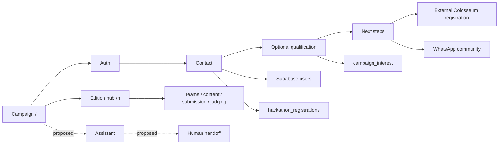

# Colosseum campaign: repository audit and delivery scope

Snapshot: `fae614a` on `main`, September 8, 2026. Working branch: `feat/felix-growth-ai`. Laura's branch is `laura` (reported by Felix; not published on origin when checked). This document describes source code, not the configuration or data currently deployed in Supabase.

## Deliverable and ownership

Build a joint preview for Kuka: a clearer campaign and registration journey, Laura's visual design, reliable measurement, and an assistant with an optional WhatsApp handoff. Production release follows review of that preview. The first sprint targets a 4–6-hour fixture preview with Felix and Laura working concurrently and preview access ready. The website assistant will use OpenRouter independently of CRM; live retrieval, model evaluation and usage controls need an additional estimated block. CRM automation has its own scope and operational dependencies.

| Owner | Work | Main integration boundary |
| --- | --- | --- |
| Laura, `laura` | Layout, typography, responsive behavior, navigation, form presentation, assistant appearance | `src/app/(public)/page.tsx`, `src/app/globals.css`, UI and campaign components |
| Felix, `feat/felix-growth-ai` | Copy proposal, measurement, attribution, assistant behavior, provider adapter, handoff, QA | `src/lib/`, analytics components, future assistant modules |
| Kuka / platform maintainer | Campaign facts, conversion definition, access, provider budget, release review | Decision questionnaire and preview acceptance |
| Both | Participant-facing wording, form states, assistant mounting, final integration | One agreed editing owner per shared file |

Do not duplicate the interest form: PR #96 already added it at 17:47 BRT on September 8, after the feedback screenshots. Do not treat August's campaign spec as the current implementation: authentication is now a separate route, member-facing registration uses a user-scoped client, and the journey has four stages.

## Architecture

Next.js 16.2.2, React 19.2.4, TypeScript, Tailwind 4; Supabase Postgres/Auth/Storage/RLS; Resend; PostHog; GTM; Sentry; Vercel region `pdx1`. `.nvmrc` specifies Node 24. The repository includes 33 page entry points, five route handlers, three layouts, 63 migrations and 18 unit test files.

The campaign and the local hackathon platform share one deployment. Edition submission mode determines whether a participant submits here or on an external platform. Avoid enabling platform team/submission/mentorship flows for the Colosseum campaign merely because those screens exist.

## Data inventory

| Data | Storage and write path | Implication for this work |
| --- | --- | --- |
| Login / identity | Supabase Auth; mirrored `users`; Google, GitHub and email OTP | Preserve callback and `next` handling; no auth checks in `(app)/layout.tsx` |
| Name, email, WhatsApp, location, headline, profile | `users`; profile actions and `preRegister` | Contact data belongs in the operational system, not analytics event properties |
| Campaign registration / terms / original attribution | `hackathon_registrations`; `preRegister` and edition register action | This is the local conversion, not proof of an external entry |
| External registration declaration | `hackathon_registrations.luma_confirmed_at`; `confirmColosseumRegistration` | Historical column name reused for self-attestation; no Colosseum verification API |
| Project idea, stage, team intent, optional notes | `campaign_interest`; `saveInterest` | Keep incomplete saves separate from completed qualification |
| Edition configuration / editable page | `hackathons.page_md`, external URL, landing path, dates | Actual campaign external URL and availability are database-owned and unverified locally |
| Teams / membership / project submission | `teams`, `team_members`, `submissions`; RLS and RPCs | Preserve deadlines, leadership and submission-mode gates |
| Recruiting | `team_openings`, `team_seekers`, `team_applications` | Existing platform feature; campaign compatibility is a product decision |
| Content / sponsors | `hackathon_contents`, `hackathon_sponsors`, storage buckets | Laura can restyle without changing permissions or asset paths |
| Administration / judging | `platform_roles`, `submission_assignments`, `submission_ratings` | Scope admin writes to the gated edition |
| Mentorship | `hackathon_mentors`, `mentorship_bookings`; RPCs | URLs and booking details must not enter a public assistant context |
| Analytics | PostHog browser/server + GTM data layer | Dashboard configuration and vendor delivery still require access |

Migrations are historical source, not evidence that all migrations ran in production. No remote database, records, keys, campaigns or provider settings were modified during this assessment.

## Findings to address in the sprint

| Priority | Evidence | Impact | Action |
| --- | --- | --- | --- |
| P0 | `/pre-registro` says completing local contact details guarantees a place in Colosseum | Users can mistake a local lead record for an official competition entry | Explicitly name local registration, external account, event registration and later project submission |
| P0 | Homepage and metadata call the 2026 event a global Solana hackathon | Current event is open across blockchain ecosystems | Describe Superteam Brasil's Solana support within the global competition |
| P0 | Hero cheque labels USD 250k as a competition prize | Confuses investment on acceptance into the accelerator with prize money | Separate prize pool, selective investment and historic outcomes |
| P0 | `preRegister` deduplicates PostHog by an earlier read; `PreregForm` pushes `inscricao_concluida_hackathon` on every successful save | GTM can count re-saves; concurrent requests can still race in the server check | Return an authoritative first-completion result and use it on both surfaces; define durable idempotency if this KPI must be exact |
| P0 | `confirmColosseumRegistration` updates the timestamp and emits on each successful update | Repeated self-confirmations can inflate a funnel | Update only the transition from null; label all reporting as self-reported |
| P1 | Several campaign events omit `edition`; resource `target` values are visible labels | Funnel segments break when copy changes | Add stable properties while retaining historic event names/values where dashboards depend on them |
| P1 | GTM ID is hardcoded; loader and noscript iframe mount at root even with denied consent | A local or preview test can reach the production container | Add explicit environment controls; inspect tag consent rules in the actual container |
| P1 | Attribution stores four UTMs for 90 days outside the analytics consent gate | This is distinct from PostHog consent; no `utm_term` and no last-touch model | Document and confirm the desired policy; retain the existing first-touch semantics in the first sprint |
| P1 | Attribution capture runs only on mount in the public layout | A client navigation that adds campaign parameters may not be captured | Test soft navigation and OAuth round trips before changing capture behavior |
| P1 | Current FAQ lists six judging criteria; the live general FAQ also lists traction | Copy can lag official guidance | Keep a dated fact sheet; avoid hardcoded rule counts |
| P1 | Deadline time, Brazil track conditions, historic case amounts and workshop promises are hardcoded | Unsupported specifics can become campaign promises | Obtain authoritative links and explicit ownership from Kuka |
| P1 | AI code/provider integration is absent; WhatsApp currently opens a group invite | A CTA is not an automated concierge or delivery confirmation | Deliver a bounded assistant and a separately measured human handoff |
| P1 | Google OAuth consent shows a Supabase project hostname in the supplied screenshot | Weakens continuity and trust during login | Configure branding/domain with the project owner; this is not just a JSX edit |
| P2 | Root layout and some child pages both use `main` | Redundant landmarks affect navigation | Include in Laura's semantic pass |
| P2 | `README.md` describes the old hub-first product; August spec differs from current code | New contributors can rebuild already replaced behavior | Use this snapshot and the source as the working baseline |

The first two analytics issues are source-level findings; they were not reproduced against live dashboards. The GTM implementation establishes denied consent but still loads the container. Therefore “no third-party request before acceptance” is not established by `docs/TRACKING.md`.

## Verification baseline

- Node 24 installed in a temporary task cache; package lock preserved.
- Dependencies installed with `npm ci --ignore-scripts`.
- Unit suite: **18 files / 212 tests passed**.
- ESLint: **passed**.
- Production build: **passed** with the CI's placeholder Supabase values; this was a compile/type gate, not a live integration test.
- No live OAuth, Supabase RLS/RPC, PostHog, GTM or provider end-to-end validation yet. Preview credentials are required for that pass.
- Browser tool discovery exposed no usable browser runtime in this session. Screenshot context was read from ten supplied HEIC captures converted to temporary PNGs; audio messages pictured in those captures were unavailable.

## Related deliverables

- [Route and screen inventory](2026-09-08-route-inventory.md)
- [Tracking and UTM plan](2026-09-08-measurement-plan.md)
- [Dated campaign facts and participant copy](2026-09-08-campaign-facts-and-copy.md)
- [Evolution hosting and messaging feasibility](2026-09-08-evolution-feasibility.md)
- [Independent OpenRouter assistant design](../superpowers/specs/2026-09-08-openrouter-assistant-design.md)
- [Implementation plan](../superpowers/plans/2026-09-08-colosseum-growth.md)

The private Portuguese workroom and stakeholder questionnaire live outside this public repository. Do not commit private conversation screenshots, stakeholder responses, secrets or exports of participant data.
